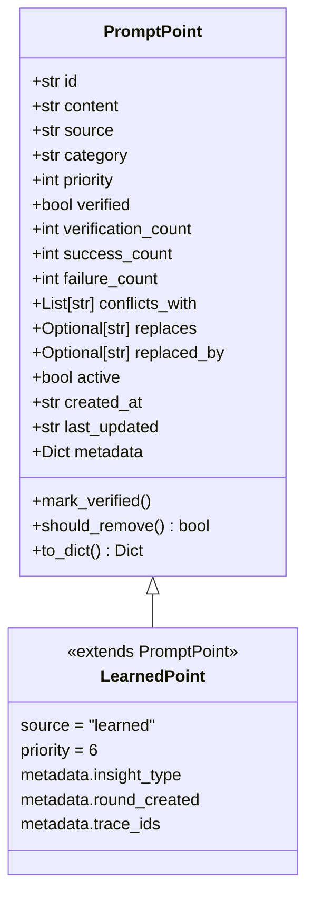

# Learned Point Data Structure

## Visual Structure Diagram



## PromptPoint Class Structure

```python
@dataclass
class PromptPoint:
    """A discrete instruction or guidance point"""
    
    # Core Identity
    id: str                          # UUID v4, unique identifier
    content: str                     # The actual instruction/guidance text
    source: str                      # "original" | "learned" | "merged"
    
    # Classification
    category: str                    # "tool_usage" | "workflow" | "warning" | 
                                      # "example" | "reference" | "general"
    priority: int = 5                 # 1-10, higher = more important
    
    # Validation & Verification
    verified: bool = False           # True when point is verified
    verification_count: int = 0       # Number of times point was identified as used
    success_count: int = 0            # Number of successful executions using this point
    failure_count: int = 0            # Number of failed executions using this point
    
    # Conflict Management
    conflicts_with: List[str] = []    # List of point IDs this conflicts with
    replaces: Optional[str] = None    # ID of point this replaces
    replaced_by: Optional[str] = None # ID of point that replaces this
    
    # Status
    active: bool = True               # False if point is deactivated
    
    # Timestamps
    created_at: str                   # ISO format timestamp
    last_updated: str                 # ISO format timestamp
    
    # Additional Data
    metadata: Dict[str, Any] = {}     # Flexible metadata storage
```

## Example: Learned Point at Different Stages

### Stage 1: Newly Created (Just Learned)

```json
{
  "id": "a1b2c3d4-e5f6-7890-abcd-ef1234567890",
  "content": "When diagnosing pod failures, always check the pod events using 'kubectl get events' before examining logs, as events often reveal the root cause faster.",
  "source": "learned",
  "category": "workflow",
  "priority": 6,
  "verified": false,
  "verification_count": 0,
  "success_count": 0,
  "failure_count": 0,
  "conflicts_with": [],
  "replaces": null,
  "replaced_by": null,
  "active": true,
  "created_at": "2025-12-02T10:30:45.123456",
  "last_updated": "2025-12-02T10:30:45.123456",
  "metadata": {
    "insight_type": "add_thinking_guidance",
    "round_created": 2,
    "trace_ids": ["trace_abc123", "trace_def456"]
  }
}
```

### Stage 2: After First Use (Identified in Trace)

```json
{
  "id": "a1b2c3d4-e5f6-7890-abcd-ef1234567890",
  "content": "When diagnosing pod failures, always check the pod events using 'kubectl get events' before examining logs, as events often reveal the root cause faster.",
  "source": "learned",
  "category": "workflow",
  "priority": 6,
  "verified": false,
  "verification_count": 1,
  "success_count": 1,
  "failure_count": 0,
  "conflicts_with": [],
  "replaces": null,
  "replaced_by": null,
  "active": true,
  "created_at": "2025-12-02T10:30:45.123456",
  "last_updated": "2025-12-02T14:15:30.789012",
  "metadata": {
    "insight_type": "add_thinking_guidance",
    "round_created": 2,
    "trace_ids": ["trace_abc123", "trace_def456", "trace_ghi789"],
    "last_used_in_trace": "trace_ghi789"
  }
}
```

### Stage 3: Verified (After Multiple Successful Uses)

```json
{
  "id": "a1b2c3d4-e5f6-7890-abcd-ef1234567890",
  "content": "When diagnosing pod failures, always check the pod events using 'kubectl get events' before examining logs, as events often reveal the root cause faster.",
  "source": "learned",
  "category": "workflow",
  "priority": 6,
  "verified": true,
  "verification_count": 5,
  "success_count": 4,
  "failure_count": 1,
  "conflicts_with": [],
  "replaces": null,
  "replaced_by": null,
  "active": true,
  "created_at": "2025-12-02T10:30:45.123456",
  "last_updated": "2025-12-03T09:20:15.456789",
  "metadata": {
    "insight_type": "add_thinking_guidance",
    "round_created": 2,
    "trace_ids": ["trace_abc123", "trace_def456", "trace_ghi789", "trace_jkl012", "trace_mno345"],
    "last_used_in_trace": "trace_mno345",
    "verified_at": "2025-12-03T09:20:15.456789"
  }
}
```

### Stage 4: In Conflict (Lower Priority Point)

```json
{
  "id": "x9y8z7w6-v5u4-3210-tsrq-ponmlkjihgf",
  "content": "Check pod logs first when diagnosing failures.",
  "source": "learned",
  "category": "workflow",
  "priority": 4,
  "verified": false,
  "verification_count": 2,
  "success_count": 1,
  "failure_count": 1,
  "conflicts_with": ["a1b2c3d4-e5f6-7890-abcd-ef1234567890"],
  "replaces": null,
  "replaced_by": "a1b2c3d4-e5f6-7890-abcd-ef1234567890",
  "active": false,
  "created_at": "2025-12-02T11:00:00.000000",
  "last_updated": "2025-12-02T15:30:00.000000",
  "metadata": {
    "insight_type": "add_thinking_guidance",
    "round_created": 2,
    "conflict_resolved_at": "2025-12-02T15:30:00.000000",
    "conflict_reason": "Contradicts higher-priority point about checking events first"
  }
}
```

## Field Descriptions

### Core Identity Fields

| Field | Type | Description | Example |
|-------|------|-------------|---------|
| `id` | `str` | Unique UUID v4 identifier | `"a1b2c3d4-e5f6-7890-abcd-ef1234567890"` |
| `content` | `str` | The actual instruction text | `"When diagnosing pod failures, always check events first"` |
| `source` | `str` | Origin of the point | `"learned"` (or `"original"`, `"merged"`) |

### Classification Fields

| Field | Type | Description | Values |
|-------|------|-------------|--------|
| `category` | `str` | Type of instruction | `"tool_usage"`, `"workflow"`, `"warning"`, `"example"`, `"reference"`, `"general"` |
| `priority` | `int` | Importance level (1-10) | `6` (default for learned points) |

### Validation Fields

| Field | Type | Description | Verification Criteria |
|-------|------|-------------|----------------------|
| `verified` | `bool` | Whether point is verified | `True` when `verification_count >= 3` AND `success_count >= 2` |
| `verification_count` | `int` | Times point was identified as used | Incremented each time point is found in a trace |
| `success_count` | `int` | Successful executions using this point | Incremented when trace shows success |
| `failure_count` | `int` | Failed executions using this point | Incremented when trace shows failure |

### Conflict Management Fields

| Field | Type | Description |
|-------|------|-------------|
| `conflicts_with` | `List[str]` | Point IDs that conflict with this point |
| `replaces` | `Optional[str]` | ID of point this replaces (if any) |
| `replaced_by` | `Optional[str]` | ID of point that replaces this (if deactivated due to conflict) |

### Status Fields

| Field | Type | Description |
|-------|------|-------------|
| `active` | `bool` | `False` if point is deactivated (conflict, replaced, or removed) |

### Timestamp Fields

| Field | Type | Description | Format |
|-------|------|-------------|--------|
| `created_at` | `str` | When point was created | ISO 8601: `"2025-12-02T10:30:45.123456"` |
| `last_updated` | `str` | Last modification time | ISO 8601: `"2025-12-03T09:20:15.456789"` |

### Metadata Field

| Field | Type | Description | Common Keys |
|-------|------|-------------|------------|
| `metadata` | `Dict[str, Any]` | Flexible storage for additional data | `insight_type`, `round_created`, `trace_ids`, `verified_at`, etc. |

## Point Lifecycle Visualization

```
┌─────────────────────────────────────────────────────────────┐
│                    POINT LIFECYCLE                          │
└─────────────────────────────────────────────────────────────┘

1. CREATION
   ┌─────────────────────────────────────┐
   │ LLM generates insight                │
   │ → Converted to PromptPoint           │
   │   - id: new UUID                     │
   │   - source: "learned"                │
   │   - verification_count: 0            │
   │   - verified: false                  │
   └─────────────────────────────────────┘
                    │
                    ▼
2. IDENTIFICATION
   ┌─────────────────────────────────────┐
   │ Point identified in execution trace   │
   │ → verification_count += 1            │
   │ → last_updated: current time        │
   └─────────────────────────────────────┘
                    │
                    ▼
3. VALIDATION
   ┌─────────────────────────────────────┐
   │ Execution result known              │
   │ → success_count += 1 (if success)   │
   │   OR                                │
   │ → failure_count += 1 (if failure)   │
   │ → last_updated: current time        │
   └─────────────────────────────────────┘
                    │
                    ▼
4. VERIFICATION CHECK
   ┌─────────────────────────────────────┐
   │ Check: verification_count >= 3?      │
   │       success_count >= 2?            │
   │ → If yes: verified = true           │
   │ → last_updated: current time        │
   └─────────────────────────────────────┘
                    │
                    ▼
5. CONFLICT DETECTION (if new point)
   ┌─────────────────────────────────────┐
   │ Check against existing points       │
   │ → If conflict found:               │
   │   - conflicts_with: [point_id]      │
   │   - Compare priorities              │
   │   - Lower priority: active = false │
   │     replaced_by = higher_point_id   │
   └─────────────────────────────────────┘
                    │
                    ▼
6. ACTIVE STATE
   ┌─────────────────────────────────────┐
   │ Point is active and used in prompts │
   │ → active: true                      │
   │ → Included in rebuilt prompts       │
   └─────────────────────────────────────┘
```

## Storage Format (JSON)

Points are stored in JSON files organized by agent type:

```
meta_agent/point_prompts/
├── diagnosis_points.json
├── localization_points.json
├── mitigation_points.json
└── rollback_points.json
```

Each file contains an array of point objects:

```json
[
  {
    "id": "a1b2c3d4-e5f6-7890-abcd-ef1234567890",
    "content": "...",
    "source": "learned",
    ...
  },
  {
    "id": "b2c3d4e5-f6g7-8901-bcde-f12345678901",
    "content": "...",
    "source": "original",
    ...
  }
]
```

## Category Mapping (for Learned Points)

When an insight is converted to a point, the `insight_type` maps to `category`:

| Insight Type | Category | Priority Default |
|--------------|----------|------------------|
| `add_guidance` | `general` | 6 |
| `add_warning` | `warning` | 6 |
| `add_recommendation` | `tool_usage` | 6 |
| `add_caution` | `warning` | 6 |
| `add_thinking_guidance` | `workflow` | 6 |
| `tool_usage` | `tool_usage` | 6 |
| `workflow` | `workflow` | 6 |
| `warning` | `warning` | 6 |
| `general` | `general` | 6 |

## Verification Logic

```python
def mark_verified(self):
    """Mark point as verified after sufficient successful uses"""
    if self.verification_count >= 3 and self.success_count >= 2:
        self.verified = True
        self.last_updated = datetime.now().isoformat()
```

## Removal Logic

```python
def should_remove(self) -> bool:
    """Check if point should be removed due to poor performance"""
    # Remove if consistently failing
    if self.failure_count >= 2 and self.success_count == 0:
        return True
    # Remove if replaced
    if self.replaced_by:
        return True
    return False
```

## Example: Complete Point Evolution

### Round 2: Point Created
```json
{
  "id": "point-123",
  "content": "Use 'kubectl describe pod' before checking logs",
  "source": "learned",
  "category": "workflow",
  "priority": 6,
  "verified": false,
  "verification_count": 0,
  "success_count": 0,
  "failure_count": 0,
  "active": true,
  "created_at": "2025-12-02T10:00:00Z"
}
```

### Round 2: After Problem 1 (Success)
```json
{
  "id": "point-123",
  "verification_count": 1,
  "success_count": 1,
  "failure_count": 0,
  "last_updated": "2025-12-02T10:30:00Z"
}
```

### Round 2: After Problem 2 (Success)
```json
{
  "id": "point-123",
  "verification_count": 2,
  "success_count": 2,
  "failure_count": 0,
  "last_updated": "2025-12-02T11:00:00Z"
}
```

### Round 3: After Problem 3 (Success) → VERIFIED
```json
{
  "id": "point-123",
  "verified": true,
  "verification_count": 3,
  "success_count": 3,
  "failure_count": 0,
  "last_updated": "2025-12-03T09:00:00Z",
  "metadata": {
    "verified_at": "2025-12-03T09:00:00Z"
  }
}
```

### Round 4: After Problem 5 (One Failure)
```json
{
  "id": "point-123",
  "verified": true,
  "verification_count": 5,
  "success_count": 4,
  "failure_count": 1,
  "last_updated": "2025-12-04T10:00:00Z"
}
```

## Key Differences: Original vs Learned Points

| Field | Original Point | Learned Point |
|-------|---------------|---------------|
| `source` | `"original"` | `"learned"` |
| `priority` | Inferred from prompt (often 5) | Default 6 (higher) |
| `created_at` | When prompt parsed | When insight generated |
| `metadata` | Usually empty | Contains `insight_type`, `round_created`, `trace_ids` |
| `verified` | Usually `false` (not tracked) | Can become `true` after validation |

