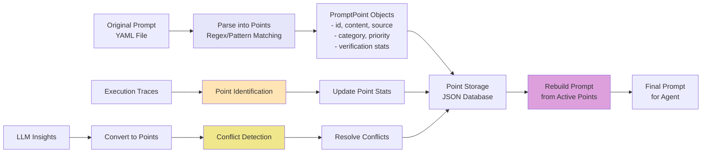
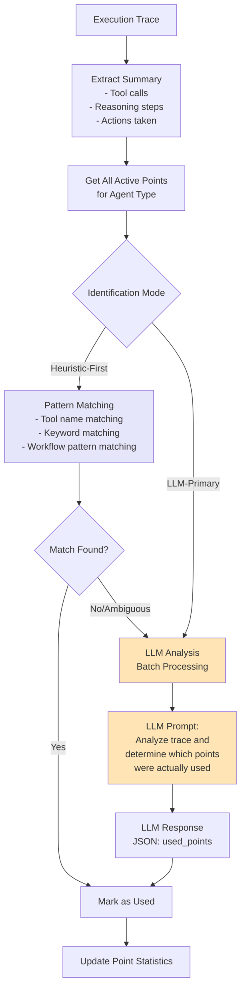
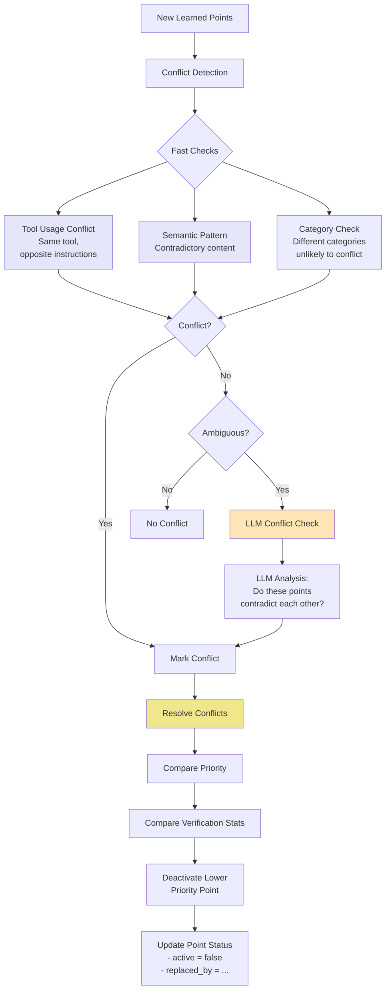
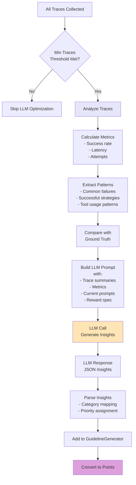
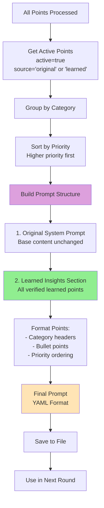

# SREGym Learning Method - Visual Diagram

## Overview Diagram

```mermaid
graph TB
    Start([Start Learning]) --> RoundInit[Round Initialization]
    
    RoundInit --> LoadPrompts{Load Previous<br/>Round Prompts?}
    LoadPrompts -->|Round 1| OriginalPrompts[Original Prompts]
    LoadPrompts -->|Round 2+| LoadedPrompts[Loaded Prompts<br/>with Accumulated Points]
    
    OriginalPrompts --> ParsePoints[Parse Prompts into<br/>Discrete Points]
    LoadedPrompts --> ParsePoints
    
    ParsePoints --> InitMetaAgent[Initialize Meta-Agent<br/>- PointManager<br/>- TraceCollector<br/>- GuidelineGenerator]
    
    InitMetaAgent --> ProblemLoop[For Each Problem]
    
    ProblemLoop --> ExecAgent[Execute Agent<br/>with Current Prompts]
    ExecAgent --> CollectTrace[Collect Execution Trace<br/>- Tool Calls<br/>- Thinking Steps<br/>- Final Submission]
    
    CollectTrace --> WaitGrading[Wait for Grading]
    WaitGrading --> StoreTrace[Store Trace with<br/>Success/Failure Status]
    
    StoreTrace --> MoreProblems{More Problems?}
    MoreProblems -->|Yes| ProblemLoop
    MoreProblems -->|No| BatchValidation
    
    BatchValidation[Batch Process All Traces<br/>Identify Used Points]
    
    BatchValidation --> PointID[Point Identification]
    
    PointID --> HeuristicCheck{Heuristic<br/>Match?}
    HeuristicCheck -->|Yes| MarkUsed[Mark Point as Used]
    HeuristicCheck -->|No| LLMCheck[LLM Analysis<br/>Check Point Usage]
    LLMCheck --> MarkUsed
    
    MarkUsed --> ValidatePoints[Validate Points<br/>Update Stats:<br/>- success_count<br/>- failure_count<br/>- verification_count]
    
    ValidatePoints --> LLMOptimization{LLM Optimization<br/>Enabled?}
    
    LLMOptimization -->|Yes| AnalyzeTraces[Analyze All Traces<br/>- Calculate Metrics<br/>- Extract Patterns<br/>- Compare with Ground Truth]
    LLMOptimization -->|No| PatternAnalysis
    
    AnalyzeTraces --> LLMGenerate[LLM Generates<br/>New Insights]
    LLMGenerate --> PatternAnalysis[Pattern-Based<br/>Insight Generation]
    
    PatternAnalysis --> Deduplicate[Deduplicate Insights]
    
    Deduplicate --> ConvertToPoints[Convert Insights<br/>to PromptPoints<br/>source='learned']
    
    ConvertToPoints --> ConflictDetect[Conflict Detection]
    
    ConflictDetect --> FastCheck{Fast Checks<br/>- Tool conflicts<br/>- Semantic patterns}
    FastCheck -->|Conflict Found| MarkConflict[Mark Conflicts]
    FastCheck -->|Ambiguous| LLMConflict[LLM Conflict Check]
    LLMConflict --> MarkConflict
    
    MarkConflict --> ResolveConflicts[Resolve Conflicts<br/>- Deactivate conflicting points<br/>- Keep higher priority]
    
    ResolveConflicts --> RebuildPrompt[Rebuild Prompt from Points<br/>1. Original points<br/>2. Verified learned points<br/>3. Active points only]
    
    RebuildPrompt --> SaveResults[Save Results<br/>- Updated prompts<br/>- Point database<br/>- Traces<br/>- Learning stats]
    
    SaveResults --> NextRound{More Rounds?}
    NextRound -->|Yes| RoundInit
    NextRound -->|No| End([End Learning])
    
    style Start fill:#90EE90
    style End fill:#FFB6C1
    style LLMCheck fill:#FFE4B5
    style LLMGenerate fill:#FFE4B5
    style LLMConflict fill:#FFE4B5
    style BatchValidation fill:#E6E6FA
    style ConflictDetect fill:#F0E68C
    style RebuildPrompt fill:#DDA0DD
```

## Detailed Component Flow

### 1. Point-Based System Architecture

### 2. Point Identification Process

### 3. Conflict Detection & Resolution

### 4. LLM Optimization Flow

### 5. Prompt Rebuilding Process

## Key Features

### Point Lifecycle

1. **Creation**: Points created from original prompts (parsing) or learned insights (LLM generation)
2. **Usage Tracking**: Points identified as "used" during execution via heuristic/LLM analysis
3. **Validation**: Points validated based on success/failure of executions where they were used
4. **Verification**: Points marked as "verified" after sufficient successful uses (≥3 verifications, ≥2 successes)
5. **Conflict Resolution**: Conflicting points resolved by deactivating lower-priority ones
6. **Rebuilding**: Prompts rebuilt from active, verified points

### Learning Mechanisms

1. **Heuristic-First Point Identification**: Fast pattern matching before LLM analysis
2. **LLM-Based Point Identification**: Deep analysis for ambiguous cases
3. **Batch Processing**: All traces processed together after round completion
4. **Incremental Conflict Detection**: Only check conflicts involving new points
5. **Caching**: Conflict detection results cached to reduce LLM calls
6. **Rate Limiting**: LLM calls rate-limited with exponential backoff retries

### Multi-Round Accumulation

- **Round 1**: Starts with original prompts only
- **Round 2+**: Loads accumulated points from previous rounds
- **Progressive Learning**: Insights accumulate across rounds
- **Preservation**: Verified points preserved across rounds
- **Refinement**: New insights refine and improve prompts

## Color Legend

- 🟢 **Green**: Start/End points
- 🟣 **Purple**: Data processing/transformation
- 🟡 **Yellow**: LLM operations
- 🔵 **Blue**: Heuristic/non-LLM operations
- 🟠 **Orange**: Conflict detection/resolution

