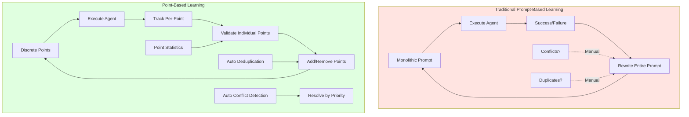

# Motivations and Benefits of Point-Based Learning

## Overview



## Overview

The point-based learning system was designed to address fundamental limitations of traditional prompt-based learning approaches. Instead of treating prompts as monolithic blocks, it decomposes them into discrete, individually trackable and validatable instruction points.

## Core Motivations

### 1. **Granular Tracking and Validation**

**Problem with Traditional Approach:**
- When a prompt contains multiple instructions, it's impossible to know which specific instruction contributed to success or failure
- Entire prompts are validated as a whole, making it difficult to identify what works and what doesn't
- No way to track individual instruction effectiveness

**Point-Based Solution:**
- Each instruction becomes a discrete `PromptPoint` with its own ID
- Individual points can be tracked, validated, and verified independently
- Success/failure statistics are maintained per-point, not per-prompt

**Example:**
```
Traditional: "Prompt A succeeded" → Can't tell which instruction helped
Point-Based: "Point X (check events first) succeeded 4/5 times" → Clear insight
```

### 2. **Conflict Detection and Resolution**

**Problem with Traditional Approach:**
- New learned insights might contradict existing instructions
- No systematic way to detect or resolve conflicts
- Conflicting instructions can confuse the agent

**Point-Based Solution:**
- Each point tracks `conflicts_with` list
- Automatic conflict detection (heuristic + LLM)
- Resolution by priority and verification status
- Lower-priority conflicting points are deactivated

**Example:**
```
Point A: "Check logs first" (priority 4)
Point B: "Check events first" (priority 6) ← Higher priority
→ Conflict detected → Point A deactivated, Point B active
```

### 3. **Incremental Learning Without Disruption**

**Problem with Traditional Approach:**
- Adding new insights requires rewriting entire prompts
- Risk of losing original formatting and structure
- Difficult to rollback specific changes

**Point-Based Solution:**
- New insights added as individual points
- Original prompts preserved intact
- Points can be activated/deactivated without affecting others
- Easy to rollback by deactivating specific points

**Example:**
```
Round 1: Original prompt (10 points)
Round 2: Original prompt + 3 new learned points
Round 3: Original prompt + 3 learned points + 2 more learned points
→ Original content never changes, only additions
```

### 4. **Deduplication and Consistency**

**Problem with Traditional Approach:**
- Same insight might be learned multiple times across rounds
- Duplicate instructions accumulate in prompts
- No way to detect or merge duplicates

**Point-Based Solution:**
- Content-based deduplication before adding points
- Exact match checking prevents duplicate points
- Single source of truth for each instruction

**Example:**
```
Round 2: Learns "Check events first"
Round 3: LLM suggests "Check events first" again
→ Duplicate detected → Existing point reused, stats updated
```

### 5. **Preservation of Original Prompts**

**Problem with Traditional Approach:**
- Learned insights mixed with original content
- Original prompt structure lost
- Hard to distinguish original vs. learned content

**Point-Based Solution:**
- Original prompts kept intact (never modified)
- Learned points stored separately with `source="learned"`
- Clear separation: Original + Learned Insights section
- Human-readable and maintainable

**Example:**
```
Final Prompt Structure:
├── Original System Prompt (unchanged)
│   ├── Original instructions
│   └── Original formatting
└── Learned Insights Section (appended)
    ├── ✅ Verified points
    └── New points
```

### 6. **Performance-Based Point Management**

**Problem with Traditional Approach:**
- No way to remove or deactivate underperforming instructions
- All instructions remain active regardless of effectiveness
- Can't prioritize based on proven success

**Point-Based Solution:**
- Each point tracks: `success_count`, `failure_count`, `verification_count`
- Points automatically verified after sufficient successful uses
- Underperforming points can be automatically removed
- Priority-based ordering in rebuilt prompts

**Example:**
```
Point X: success_count=0, failure_count=3
→ should_remove() returns True
→ Point deactivated automatically
```

## Key Benefits

### 1. **Precision in Learning**

```
┌─────────────────────────────────────────────────┐
│  Traditional: "Prompt improved"                 │
│  Point-Based: "Point X improved, Point Y failed"│
└─────────────────────────────────────────────────┘
```

**Benefits:**
- Know exactly which instructions work
- Remove or refine specific failing instructions
- Build on proven successful patterns
- Data-driven decision making

### 2. **Conflict-Free Learning**

```
┌─────────────────────────────────────────────────┐
│  Traditional: Conflicting instructions coexist   │
│  Point-Based: Conflicts detected and resolved    │
└─────────────────────────────────────────────────┘
```

**Benefits:**
- No contradictory instructions in final prompts
- Clear resolution strategy (priority-based)
- Agent receives consistent guidance
- Reduced confusion and errors

### 3. **Incremental Improvement**

```
┌─────────────────────────────────────────────────┐
│  Traditional: All-or-nothing prompt updates      │
│  Point-Based: Add/remove individual points       │
└─────────────────────────────────────────────────┘
```

**Benefits:**
- Low-risk incremental changes
- Easy rollback of specific points
- Gradual refinement over rounds
- Preserve what works while improving what doesn't

### 4. **Transparency and Debugging**

```
┌─────────────────────────────────────────────────┐
│  Traditional: Black box prompt changes          │
│  Point-Based: Full audit trail per point        │
└─────────────────────────────────────────────────┘
```

**Benefits:**
- See exactly what was learned and when
- Track point lifecycle (created → used → verified)
- Understand which points contributed to success
- Debug issues by examining specific points

### 5. **Efficient Conflict Detection**

```
┌─────────────────────────────────────────────────┐
│  Traditional: O(N²) full comparison              │
│  Point-Based: Incremental checks (new points)   │
└─────────────────────────────────────────────────┘
```

**Benefits:**
- Only check conflicts for new points
- Caching reduces redundant LLM calls
- Fast heuristic checks before LLM
- Scalable to hundreds of points

### 6. **Selective Validation**

```
┌─────────────────────────────────────────────────┐
│  Traditional: Validate entire prompt            │
│  Point-Based: Validate only learned points       │
└─────────────────────────────────────────────────┘
```

**Benefits:**
- Original points don't need validation (already proven)
- Focus validation effort on new insights
- Faster validation cycles
- Clear separation of concerns

### 7. **Multi-Round Accumulation**

```
┌─────────────────────────────────────────────────┐
│  Traditional: Each round starts fresh           │
│  Point-Based: Points accumulate across rounds   │
└─────────────────────────────────────────────────┘
```

**Benefits:**
- Knowledge builds progressively
- Verified points preserved across rounds
- No loss of learned insights
- Continuous improvement

## Comparison: Traditional vs. Point-Based

| Aspect | Traditional Approach | Point-Based Approach |
|--------|---------------------|---------------------|
| **Granularity** | Prompt-level | Point-level |
| **Tracking** | Prompt success/failure | Per-point statistics |
| **Validation** | Entire prompt | Individual points |
| **Conflict Detection** | Manual/None | Automatic |
| **Deduplication** | Manual/None | Automatic |
| **Rollback** | Full prompt revert | Deactivate specific points |
| **Original Preservation** | Mixed with learned | Preserved separately |
| **Incremental Updates** | Rewrite entire prompt | Add/remove points |
| **Transparency** | Low (black box) | High (full audit trail) |
| **Debugging** | Difficult | Easy (point-level) |
| **Scalability** | Limited | High (incremental checks) |

## Real-World Scenarios

### Scenario 1: Conflicting Instructions

**Traditional:**
```
Prompt contains:
- "Check logs first"
- "Check events first" (learned in Round 2)
→ Both remain, agent confused
```

**Point-Based:**
```
Point A: "Check logs first" (priority 4)
Point B: "Check events first" (priority 6, learned)
→ Conflict detected → Point A deactivated → Only Point B active
```

### Scenario 2: Underperforming Instruction

**Traditional:**
```
Prompt contains 20 instructions
One instruction causes failures
→ Can't identify which one
→ Must rewrite entire prompt
```

**Point-Based:**
```
Point X: success_count=0, failure_count=3
→ Automatically identified as underperforming
→ Deactivated without affecting other points
```

### Scenario 3: Duplicate Learning

**Traditional:**
```
Round 2: Learns "Use kubectl describe"
Round 3: Learns "Use kubectl describe" again
→ Duplicate instruction in prompt
```

**Point-Based:**
```
Round 2: Creates Point A "Use kubectl describe"
Round 3: Detects duplicate → Reuses Point A
→ Single point, stats accumulate
```

### Scenario 4: Incremental Improvement

**Traditional:**
```
Round 1: 10 instructions
Round 2: Rewrite with 13 instructions (3 new)
Round 3: Rewrite with 15 instructions (2 more)
→ Risk of breaking what worked
```

**Point-Based:**
```
Round 1: 10 original points
Round 2: 10 original + 3 learned points
Round 3: 10 original + 5 learned points
→ Original points unchanged, only additions
```

## Technical Advantages

### 1. **Efficient Storage**
- Points stored as JSON (structured, queryable)
- Separate files per agent type
- Easy to load/save incrementally

### 2. **Fast Conflict Detection**
- Incremental: Only check new points
- Caching: Results cached to avoid redundant checks
- Heuristic-first: Fast checks before expensive LLM calls

### 3. **Flexible Metadata**
- Each point can store custom metadata
- Track round created, trace IDs, verification timestamps
- Extensible for future features

### 4. **Version Control Friendly**
- JSON files are diff-friendly
- Easy to see what changed between rounds
- Can track point evolution over time

### 5. **Query and Analysis**
- Can query points by category, priority, verification status
- Analyze which categories perform best
- Identify patterns in successful points

## Summary

The point-based learning system transforms prompt engineering from a monolithic, black-box process into a granular, transparent, and data-driven approach. By decomposing prompts into discrete, trackable points, it enables:

1. **Precision**: Know exactly what works and what doesn't
2. **Safety**: Incremental changes with easy rollback
3. **Efficiency**: Automatic conflict detection and deduplication
4. **Transparency**: Full audit trail and debugging capability
5. **Scalability**: Efficient handling of hundreds of points
6. **Preservation**: Original prompts remain intact and human-readable

This approach makes the learning process more reliable, maintainable, and effective, ultimately leading to better-performing agents through systematic, evidence-based prompt refinement.

