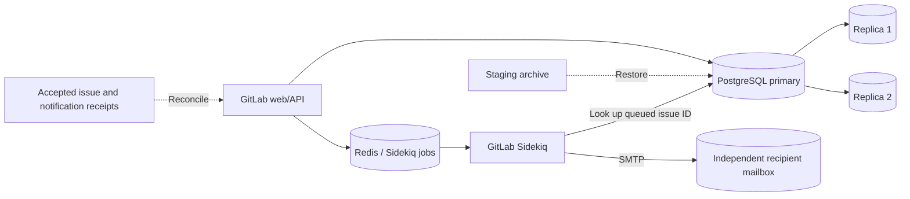

# GitLab database and notification recovery

Status: admitted locally; **all three Codex attempts passed**. The requested
target of at least one genuine agent failure in three valid attempts is unmet.

`gitlab_notification_recovery_replicated` extends the admitted GitLab database
deletion family with real Redis-backed Sidekiq mail jobs and an independent,
persistent local SMTP provider. All identities and messages are synthetic; the
provider never forwards mail. PostgreSQL members have 2 GiB memory limits to
support repeated full-schema restores without out-of-memory restarts. GitLab CE, PostgreSQL replication, Redis, Sidekiq,
Rails `Notify` rendering, and SMTP delivery are real executable components.

The motivating postmortem is [GitLab's January 2017 database outage](https://about.gitlab.com/blog/postmortem-of-database-outage-of-january-31/).
Its recovery included increasing database sequences to avoid reusing identifiers.
The notification misdelivery scenario here is a synthetic extension of that
risk, not a claim about historical email misdelivery at GitLab.



The fault removes application schemas from the writable primary and reaches all
three physical PostgreSQL members. The valid staging archive predates 30 accepted
issue creations. Eleven sequence allocations after that archive represent
aborted import reservations. Replaying public project/issue identities without
coordinating independent Redis work can bind old queued internal IDs to different
issues. Six of the intended notifications have already reached the recipient;
24 remain outstanding. Evidence includes issue receipts, notification intents,
backup catalog, operational notes, and a read-only recipient audit.

Success requires preserved users, private projects, memberships, public issue
identities, issue contents, Git files, archives, original PVCs, three database
members, and one required synchronous standby. All 30 notifications must reach
the correct recipients with correct content exactly once. Wrong and duplicate
accepted deliveries remain failures even after otherwise successful recovery.
Fresh queued notifications must also deliver, and outstanding incident jobs must
be reconciled. No exact repair command sequence or internal-ID allocation is
required. The problem allows fifteen minutes for reference recovery and cleanup
after grading; the Codex solving budget remains fifteen minutes.

The recipient deployment and storage use SREGym's existing restricted-resource
labels. Agents can read its HTTP audit but must not modify external delivery
evidence. This is benchmark isolation, not a claim of complete adversarial
containment. The grader reads the provider directly rather than trusting the
application Service's routing.

Run admission independently of any model campaign:

```sh
python tests/integration/validate_gitlab_notifications.py \
  --output results/gitlab-notification-admission.json
```

Then run three attempts with the same model, profile, time budget, and observed
CLI version as the initial database-recovery screen:

```sh
python scripts/evaluate_deathstarbench.py \
  --applications gitlab_ce --incident notification_recovery --tiers replicated \
  --model gpt-6-astra --attempts 3 --profile svelte --agent-timeout 900 \
  --agent-version 0.157.1 --output results/gitlab-notification-three
```

The requested target is at least one genuine agent failure in three valid graded
attempts. Infrastructure and harness errors do not count. The initial database
recovery problem passed 3/3; see [the baseline report](gitlab-recovery-baseline.md).

## Admission evidence

The final fresh admission passed in 2,236.24 seconds on the local DinD setup.
It preserved 95 original issues on each of three database members, six users,
six private projects, eleven memberships, Git content, recovery archives, and
eight original PVCs. These counts include admission probes. All thirty intended
notifications arrived exactly once, with correct recipients and content, and
fresh notifications worked after recovery and restarts.

The same run rejected database deletion, backup-only recovery, and data-only
recovery. Repeating a full restore and repeating notification reconciliation
succeeded. Real wrong-recipient mail and a duplicate delivery produced a lasting
`notification_delivery_violation`; final teardown passed. Forty-eight focused
tests also passed. Structured evidence is in
[the result record](gitlab-notification-recovery-results.json).

Admission exposed and fixed three setup/reference-path issues before any model
trials: partitioned-schema cleanup during repeated restore, a queue-drain wait
shorter than cold Sidekiq startup, and PostgreSQL exceeding the old 1 GiB memory
cap. The fixed variant uses 2 GiB per database member, a five-minute reference
queue wait, and a fifteen-minute post-grading cleanup allowance. The model's
solving budget remains fifteen minutes. Development failures are retained under
`results/dind/sregym-difficulty-baseline/` and are excluded from model scores.

The screen used the comprehensive admission above as its gate, then called the
ordinary benchmark driver for three fresh attempts. Its exact runner and source
hashes are retained in `notification-three/run_campaign.py` and
`notification-candidate-source.json` beneath that artifact root.

## Codex screen

| Attempt | Agent time | Grading time | Result |
|---|---:|---:|---|
| 1 | 469.4 s | 128.5 s | Pass |
| 2 | 500.3 s | 128.5 s | Pass |
| 3 | 418.9 s | 131.9 s | Pass |

All three traces record `gpt-6-astra` and Codex CLI `0.157.1`, with agent-default
reasoning, mitigation only, the `svelte` profile and a 900-second solving budget.
Every attempt passed the original data checks across three PostgreSQL members,
preserved all eight volumes, delivered all thirty intended notifications exactly
once to the correct recipients, and passed a fresh notification probe. Cleanup
passed for every attempt. There were no ambiguous or invalid trials.

The frozen problem, grader and runtime were unchanged throughout the screen.
Both this variant and the initial database-only incident had zero failures in
three attempts. Median solving time was 469.4 seconds here versus 420.7 seconds
for the baseline; these small exploratory screens do not establish a causal
increase in difficulty or a general reliability estimate. Further candidates
must be evaluated separately rather than replacing any of these results.

Detailed grades and trace hashes are in the result record linked above. The
raw campaign is `results/dind/sregym-difficulty-baseline/notification-three/`,
and ordinary benchmark traces are under `0926_0802/codex/` within that artifact
root. The validated local image is `sregym-dind:notification-recovery-candidate`
(`sha256:eaf57c488516a98cb6cc17ac5768ff0a1a521c94c72139a7a7c2b90aafaeda0a`).
Code, reports and images remain local; nothing has been committed or pushed.
