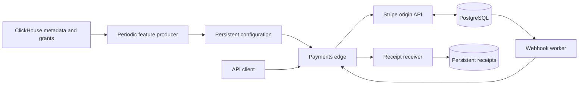

# Postmortem incident families on the SaaS applications

Two opt-in families add four problems. Each runs inside the existing private
DinD cluster and uses the application's real API and persistent state. These
are bounded executable approximations, not reproductions of production scale.

| Family | Single tier | Replicated tier | Recovery objective |
|---|---|---|---|
| GitLab database deletion | 1 PostgreSQL member; 3 incident projects; 12 historical + 6 recent issues | 3 PostgreSQL members; 5 projects; 60 historical + 30 recent issues | Validate backups, restore the database, reconcile acknowledged issues at their original public URLs, preserve access settings and Git files |
| Stripe feature configuration | 1 PostgreSQL member; 6 acknowledged payments awaiting notification | 3 PostgreSQL members; 24 acknowledged payments awaiting notification | Stop recurring oversized edge configuration and deliver original webhook events without changing or duplicating payments/refunds |

Replicated PostgreSQL requires one synchronous standby. All database members
have separate volumes. GitLab adds four application/archive volumes, giving
5/7 total PVCs; Stripe adds receipt, feature-control and ClickHouse volumes,
giving 4/6. Application instance counts stay fixed. The larger tiers increase
state and reconciliation work, not application throughput or geographic scale.

## GitLab: wrong-primary deletion and incomplete backups

The January 2017 incident combined replication trouble, deletion on the wrong
host, broken expected backups and a usable older snapshot. Git repository
storage survived; some database writes could not be recovered. The incident also
required follow-up reconciliation and care with identifiers.
[GitLab's postmortem](https://about.gitlab.com/blog/postmortem-of-database-outage-of-january-31/)

The mock uses modern GitLab CE with external PostgreSQL and Redis. Replica
maintenance connects to the writable service under a misleading shell label and
drops the application's schemas. Physical standbys replay the deletion, so
simply promoting one does not restore the missing history. The independent
recovery console contains an actually truncated recent `pg_dump` archive, a
misleading job catalog, a valid older archive, operations/chat/ticket evidence,
and ordered issue-creation receipts accepted after that archive.

The grader retains an external inventory of users, project privacy, memberships,
issue content/confidentiality/public IDs, and Git file hashes. It checks every
PostgreSQL member, original volume identities, configured replication, archive
integrity, the original business probe and new business operations. An older
backup can restore availability while still failing for lost acknowledged work.
Duplicate or conflicting replay also fails. Fresh unrelated work is allowed.

Logical schema deletion substitutes for the historical physical-directory
mistake. WAL-propagated schema loss approximates having no usable live replica.
The synthetic receipt journal permits complete recovery of the selected
acknowledged issues; it does not claim GitLab recovered all historical losses.
The inventory covers selected incident data, not every GitLab table, repository
branch, permission or background queue. Puma, Sidekiq and Gitaly remain in one
application pod. No full backup service, human responder simulation or elapsed
18-hour recovery is claimed.

## Stripe: recurring configuration failure and delivery recovery

Cloudflare's November 2025 incident involved a ClickHouse permissions change,
an insufficiently scoped metadata query, duplicated features in generated files,
and an edge feature-count limit. Mixed rollout state produced alternating good
and bad publications. Stopping publication and restoring known-good
configuration preceded the end of downstream recovery.
[Cloudflare's postmortem](https://blog.cloudflare.com/18-november-2025-outage/)

The Stripe reference adapter now has an incident-specific edge proxy and
configuration producer, backed by a real ClickHouse catalog. Two databases have
matching 120-column feature tables. Initially both rollout identities see only
one table. Expanding one identity's grants exposes both tables to an unqualified
`system.columns` query, producing 240 entries against a 200-feature capacity.
The producer alternates identities every 20 seconds. Oversized files cause real
HTTP 500 responses on payment traffic and webhook delivery; direct metrics,
origin access and Kubernetes process readiness remain available.



Before the rollout, the harness acknowledges payments and partial refunds while
the worker is paused. The first bad publication exhausts bounded delivery
retries. Events and failed delivery history remain durable. Mixed publication
then proceeds without harness intervention. An operator replay tool requeues
original events transactionally, skips pending/successful work, and never
creates financial transactions. The receiver deduplicates event IDs.

The grader checks the deployed query under every configured rollout identity,
so a currently good file cannot hide a future bad generation. It accepts a
properly scoped query, a permissions rollback, paused publication plus a valid
known-good file, or the documented emergency bot-management kill switch. It also
requires intact acknowledged business records, no duplicate charges/refunds,
original event delivery and receipts, original volumes and database durability.
A passing evaluation samples traffic for 42 seconds, longer than two publication
periods. Containment alone and partial webhook replay fail.

One real catalog with two access identities approximates a mixed fleet rollout;
one edge process represents the affected proxy path. The edge limit is a Python
HTTP failure, not the original proxy's implementation. The publication clock and
retry budgets are compressed. The Stripe application still uses its bounded
single-JSONB-row persistence adapter, synthetic test payments and a local receipt
sink. This is Cloudflare's failure mechanism applied to another application,
not a claim that Stripe experienced this outage. No card network or external
SaaS service is contacted.

## Running and validating

The local reproduction image is `sregym-dind:postmortems`. To build it from a
checkout, use `python3 docker/dind/run.py build --image sregym-dind:postmortems`.
Start a private environment:

```bash
python3 docker/dind/run.py run --image sregym-dind:postmortems \
  --name postmortems --cpus 8 --memory 34g --docker-tmpfs-size 24g
```

In another terminal, wait for `/run/sregym-ready`, then prepare the pinned
operator and licensed Stripe adapter:

```bash
docker exec postmortems test -f /run/sregym-ready
docker exec postmortems python scripts/prepare_saas_prototypes.py
```

Use a fresh DinD session for each incident family and for the ordinary conductor
check below. KIND workers retain separate image caches; multiple copies of the
large GitLab image plus observability images can fill the 24 GiB private disk.
See [SaaS setup](saas-prototypes.md) for the broader application workflow.
ClickHouse uses `clickhouse/clickhouse-server:25.8.12.129-alpine`. Keep the runtime
image IDs and source revision with evaluation results.

The normal conductor runs intervention mode: the incident continues until the
agent changes the environment. These registered IDs are opt-in and are not added
to the default task list:

```text
gitlab_database_deletion_single
gitlab_database_deletion_replicated
stripe_feature_config_single
stripe_feature_config_replicated
```

For a bounded scripted reconstruction and negative-control trace, run:

```bash
docker exec postmortems python tests/integration/validate_gitlab_recovery.py \
  --tier single --output results/gitlab-single.json
docker exec postmortems python tests/integration/validate_stripe_config.py \
  --tier single --output results/stripe-single.json
```

Repeat with `--tier replicated`. These validators execute the causal fault,
reject partial recovery, apply reference recovery and verify persistence after
restart. Their JSON outputs are traces of observed states and grader decisions,
not agent trajectories or historical command transcripts. They clean up their
application namespaces and volumes. Run these commands sequentially. Tiers of
the same application share a namespace, and conductor startup resets cluster
configuration, including worker kubelets. Conductor validation and model runs
need exclusive use of their cluster even when applications have different names.

The ordinary lifecycle validator exercises the registered conductor interface:

```bash
docker exec postmortems python tests/integration/validate_problem.py \
  --problem stripe_feature_config_single --profile svelte \
  --summary results/stripe-lifecycle.md --json-summary results/stripe-lifecycle.json
```

The comparison runner supports both families, for example:

```bash
docker exec postmortems python scripts/evaluate_deathstarbench.py \
  --applications gitlab_ce --incident database_deletion \
  --model YOUR_CONFIGURED_MODEL --attempts 3
docker exec postmortems python scripts/evaluate_deathstarbench.py \
  --applications stripe_marathon --incident feature_config \
  --model YOUR_CONFIGURED_MODEL --attempts 3
```

Environment admission is separate from agent evaluation. The replicated GitLab
deletion case subsequently passed a [three-attempt Codex screen](gitlab-recovery-baseline.md).
The [notification-recovery variant](gitlab-notification-recovery.md) adds
independently persistent jobs and external delivery effects and also passed 3/3.
The replicated Stripe case passed its [three-attempt screen](stripe-config-screen.md).
The single-tier cases still need graded model attempts before making any claim
about difficulty.
