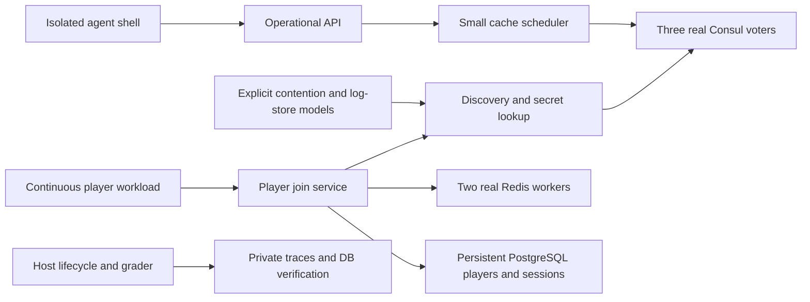

# Roblox Consul incident family (Tier 0 prototype)

A runnable first incident family, separate from the 1.x Kubernetes conductor and
problem sets. It implements a small gaming backend, then disrupts its shared
control plane and exercises the recovery tail. This is **a hybrid executable
approximation**, not Roblox software or a reproduction of the upstream defects.

**Scope limitation:** this is a harness exercise, not the proposed ultra-long-horizon
Roblox environment. Three fresh scaled-tier Codex trials passed in 4m 48s–6m 43s,
with the central repairs issued within 49 seconds. See the
[validation record](VALIDATION.md) and
[required architectural changes](../../../docs/roblox-long-horizon-gap.md).

## Run locally

Requires Linux Docker Engine with Compose v2, Python 3.10+ for the host launcher,
and permission to run Docker (`sudo docker` for non-root users). Services use
Python 3.12 in containers. No host Python packages, Kubernetes, Khaos, or extra
CloudLab nodes are needed. Allow about 4 GB RAM per run, plus image storage.

From the repository root:

```bash
python3 -m sregym.postmortems.roblox_consul --run demo up
python3 -m sregym.postmortems.roblox_consul --run demo inject
python3 -m sregym.postmortems.roblox_consul --run demo shell
# Inside the toolbox:
ops help
ops status
curl -s http://gateway:8080/metrics
exit

# Host-side outcome grading (nonzero exit means failure):
python3 -m sregym.postmortems.roblox_consul --run demo grade
# Known-good reference recovery, intended for environment validation:
python3 -m sregym.postmortems.roblox_consul --run demo oracle
python3 -m sregym.postmortems.roblox_consul --run demo down
```

`up` verifies a healthy baseline before returning. `inject` is one-shot. `reset`
exports and archives the old episode, removes only that run's volumes/networks,
and creates a fresh healthy episode. `down` preserves exported results. Use
unique names for concurrent runs. Ports are allocated dynamically on loopback.
Build failures leave artifacts for inspection; `down` cleans partial setups.

## What actually runs



The nine containers are three Consul servers, PostgreSQL, two Redis workers, the
control service, gateway, and toolbox. The scheduler, secrets lookup, telemetry,
catalog writer, and load generator are modules in the control service, **not
full Nomad/Vault/monitoring deployments**. Joins read cached or persistent player
records and create real database sessions. Catalog registration and heartbeat
writes continue while player admission is zero.

The operator can change client settings, inspect per-node profiles, transfer
actual Raft leadership, perform modeled follower maintenance, save/restore real
Consul snapshots, repair allocation records, drain workers, warm caches, and
adjust traffic admission. Side effects persist. Restoring a snapshot can undo
scheduler repairs. Cache flushing under live traffic overloads the origin read
budget. Derived alerts, a synthetic support ticket, local incident chat/status updates,
runbooks, and six bounded expert consultations are available.

## Historical grounding and approximation boundary

Source: Roblox Engineering, [Roblox Return to Service](https://about.roblox.com/newsroom/2022/01/roblox-return-to-service-10-28-10-31-2021),
January 20, 2022. The report describes streaming contention plus leader-specific
BoltDB freelist amplification, disrupted dependent systems, stale cache scheduling,
and gradual reopening after caches recovered. It reports no user-data loss.

| Mechanism | This implementation |
| --- | --- |
| Shared Consul control plane | Real three-voter Raft quorum; KV, catalog, snapshots, leadership transfers |
| Streaming contention | Explicit shared-lock/fanout latency model; not native Consul streaming reproduction |
| BoltDB slow leaders | Persistent per-node freelist cost model; compaction changes that model, not real BoltDB pages |
| Stale scheduling after restore | Actual restored KV records disagree with cache deployment generation |
| Unhealthy worker preferred by scheduler | Small scheduler consumes stale capacity and probes real Redis reachability |
| Cache recovery | Real Redis reads/writes and PostgreSQL fallback, with a modeled origin read budget |
| DNS steering | Deterministic player-ID cohort admission at the gateway; no authoritative DNS server |
| Monitoring dependency | Aggregate metrics require the impaired discovery path; local logs/profiles remain available |

Consul 1.15.4 is pinned for the laboratory's Raft operations API; the incident
used the 1.10 generation. Native Consul metrics are returned separately from
explicitly labeled model profiles. The 73-hour timeline, hardware topology,
NUMA effects, billion-request cache scale, and production BoltDB file geometry
are **not** reproduced. Time and capacity constants are laboratory parameters.
A future higher-fidelity tier should replace these fault models with a measured
upstream-bug reproducer while retaining the outcome grader.

## Modes and tiers

```bash
python3 -m sregym.postmortems.roblox_consul --run large up --tier scaled --mode historical --seed 7
python3 -m sregym.postmortems.roblox_consul --run early up --mode intervention --seed 42
```

`historical` starts at a compressed checkpoint after containment and a Consul
snapshot restore, including stale scheduler state and cold caches.
`intervention` starts after the same initial control-plane failure and containment,
but before that restore; allocation metadata is still current. Operators can
avoid adding the snapshot-related recovery problem. Neither mode grades an exact
historical command sequence. Both begin with external traffic in maintenance.

| Parameter | small | scaled |
| --- | ---: | ---: |
| Player records | 120 | 600 |
| Catalog routing registrations | 24 | 96 |
| Catalog updates per active cycle | 12 | 36 |
| Logical cache shards | 2 | 6 |
| Offered player requests/second | 20 | 60 |
| Initially slow voters | 1 | 2 |

These are two workload tiers of one family, not six independent cache servers or
a claim that the ten-task roadmap milestone is complete. Physical container count
and dependency depth currently remain constant. Seeds choose the affected voters;
the causal structure stays the same.

## Grading and traces

The host grader tests full admission, at least 98% successful/correct joins under
continuous offered load, a sufficient observation window, exact preservation of
all original player rows, three voters, and no additional origin overloads. It
also transfers leadership to **each real voter** to expose latent recurrence.
Evidence-collection failures produce `valid: false`, not a successful score or
an ordinary agent-failure datum.
Temporary maintenance, a stopped workload, healthy process endpoints, and cached
responses hiding database damage cannot establish success. An unsafe reopen can
recover availability later but still fail the safety invariant.

`results/roblox-consul/<run>/` contains the run manifest, image identities,
baseline and final grades, container logs, operation JSONL, and telemetry JSONL.
The random runner token is private; do not distribute it with shared artifacts.
These results are ignored by Git. The actor image does not contain the grader,
oracle, fault controller source, token, repository, or host Docker socket.
Control API fault injection/evidence endpoints require the token. The toolbox
cannot access the backend network directly. This is a bounded operations surface,
not unrestricted root access to Consul hosts.

## Codex evaluation

The launcher uses the installed native CLI plus its code-mode companion, when
present. It copies only authentication into an ephemeral container, with a clean
Codex home, and destroys it afterward. The agent has outbound networking for
inference, but no host source or backend storage mounts. This is **not a filtered
internet evaluation**; web search is disabled in the CLI, but shell egress exists.

```bash
python3 -m sregym.postmortems.roblox_consul --run agent-1 up
python3 -m sregym.postmortems.roblox_consul --run agent-1 inject
python3 -m sregym.postmortems.roblox_consul --run agent-1 benchmark --timeout 600
# Optionally select --model, --codex-binary and --auth-file explicitly.
```

`codex.jsonl`, `codex.stderr.log`, native session traces, and `benchmark.json` are
saved before the agent is removed. The model's final claim does not determine
success: the independent grader runs afterward. A timeout stops the container
and all its child processes. Use fresh episodes for repeated model evaluations;
this prototype has not established model reliability statistics.

## Validation

```bash
pytest -q tests/postmortems
SREGYM_POSTMORTEM_INTEGRATION=1 pytest -q tests/postmortems/test_roblox_integration.py
```

See [the local validation record](VALIDATION.md) for measured results.

Fast tests cover fault independence and false-pass cases. The opt-in Docker suite
checks healthy baselines, injection, broken monitoring, ineffective snapshot
restore, full recovery, database corruption hidden by a cache, cold-cache overload,
persistence of that safety violation after restart, and cleanup across both tiers
and modes. It stores separate grades for expected failures and successful recovery.

The existing DinD branch can provide an outer Docker runtime for this harness;
this family uses Compose directly and does not require its KIND cluster. No
changes to the 1.1/Cognition task set or the DinD PR are included here.
