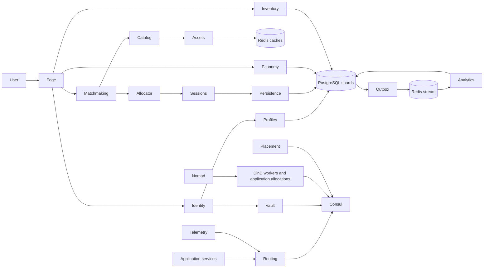

# Native gaming platform for the Roblox incident family

This replaces the Tier 0 operational model with a running application and native
control-plane services. It is **under validation**, not a claim that Roblox's
73-hour incident or an ultra-long-horizon benchmark has been reproduced.
The old `roblox_consul` package remains the frozen three-trial baseline.

## What changed

- The agent receives symptoms and normal operations documentation. It has SSH,
  native Consul/Nomad/Vault commands, application source, process logs, metrics,
  and native Consul pprof endpoints. There are no generated fault profiles,
  incident-specific expert answers, or `compact`/`reconcile` repair API.
- Nomad actually schedules and replaces containers on isolated Docker-in-Docker
  workers. Consul runs its upstream 1.10.4 streaming implementation. Vault stores
  encrypted secrets in the same Consul cluster and participates in real leases.
- Sixteen service types execute as independent scheduled allocations: edge,
  identity, profiles, inventory, catalog, assets, matchmaking, allocator,
  sessions, persistence, economy, outbox, analytics, telemetry, placement, routing.
  User requests cross several layers and create real database records.
- Two PostgreSQL shards hold players, sessions, purchases, outboxes and receipts;
  four Redis cache pools in the base scenario, or 24 in the recovery-tail scenario,
  hold expiring application data; another Redis instance holds the durable processing
  stream. Purchases are transactional and retries
  are idempotent. Consumers reclaim pending messages after restarts.
- The routing layer builds actual endpoint tables from native streaming events.
  Placement allocations make real catalog updates and, in the latent-leader
  scenario, own separate player-reservation shards. A player session must reach
  its live shard owner, so reducing placement capacity has a direct user impact.
  These systems continue working independently of external traffic admission.
  Aggregate telemetry must discover and reach services through the affected
  routing path.
- Optional storage preparation writes and deletes real Bolt pages in an offline
  follower's Raft file. Existing Raft buckets are retained. The native `bbolt`
  tool can inspect/rewrite files; no latency counter is cleared by an operation.



## Run

Linux/amd64, Docker Engine with Compose v2, cgroup v2, Python 3.10+, and passwordless
Docker access (`sudo -n docker` supported). The supplied node has sufficient RAM
for the validated expanded configuration. The fleet tier is a configuration,
not yet a capacity-validated result. Workers require privileged DinD; this is a
trusted laboratory environment, not a VM-strength boundary against hostile agents.
There is no host Docker socket or evaluator directory mounted into agent hosts.

```bash
python3 -m sregym.postmortems.roblox_platform.bootstrap
python3 -m sregym.postmortems.roblox_platform --run platform-a up --tier expanded
python3 -m sregym.postmortems.roblox_platform --run platform-a grade
python3 -m sregym.postmortems.roblox_platform --run platform-a start-traffic
python3 -m sregym.postmortems.roblox_platform --run platform-a inject --tenants 1024
python3 -m sregym.postmortems.roblox_platform --run platform-a shell
# After operator recovery:
python3 -m sregym.postmortems.roblox_platform --run platform-a grade
python3 -m sregym.postmortems.roblox_platform --run platform-a down
```

To benchmark Codex instead of opening an operator shell, start traffic and
inject as above, verify that the pre-agent grade fails, then run:

```bash
python3 -m sregym.postmortems.roblox_platform.benchmark \
  --run platform-a --model gpt-6-astra --timeout 3600
```

The benchmark runs Codex in a disposable operator container, preserves its
trace and workspace, and grades independently after it exits. It copies local
Codex authentication into that container only for the session, removes the
container afterward, and leaves the incident stack running for inspection.
Stop it with the `down` command when finished. The benchmark's outbound network
is separate from the operational network; no host Docker socket, runner, grader,
or private traffic journal is mounted in the agent container.

The default `inject` performs native Nomad rollouts that increase route
subscriptions and catalog-write frequency. It is an experimental workload
trigger, **not a guarantee of the historical failure at every scale**. Measure
the resulting latency, errors, process profiles, memory pressure, and recovery.
No sleeps or fault-state booleans create dependency latency.

The expanded tier also has an experimental latent-leader scenario. Build the
storage fixture below, then run:

```bash
python3 -m sregym.postmortems.roblox_platform --run latent-a up --tier expanded --scenario latent-leader
python3 -m sregym.postmortems.roblox_platform --run latent-a start-traffic
python3 -m sregym.postmortems.roblox_platform --run latent-a grade
python3 -m sregym.postmortems.roblox_platform --run latent-a inject
python3 -m sregym.postmortems.roblox_platform.benchmark --run latent-a --model gpt-6-astra --timeout 3600
```

Preparation creates a real fragmented Raft BoltDB file on one follower before
the application starts. The calibrated latent tier has four streaming routers
with 128 tenant tables each, 14 reservation shards, and seven catalog writers.
All three Consul nodes then receive the same cgroup-v2
write-throughput bound. A clean-leader baseline must pass. During injection,
the host briefly quiesces placement writers and releases the bound so the
prepared follower can catch up and win a native election; the writers and
original bound are restored before the operator enters. Nomad job definitions
do not change. Two independent post-injection grades must fail for the runner
to accept the incident. The bound normalizes this fast laboratory disk; it is
not a claim about Roblox's exact disk throughput.

The experimental `recovery-tail` scenario uses the same latent Consul trigger
and schedules 24 Redis cache pools across six Nomad workers on persistent storage.
An independent cache-reconciler job probes real Consul KV write latency and rolls
pools one at a time when a requested redeployment becomes safe. The incident arms
unwritable cache storage on one still-ready worker and requests that redeployment.
The existing pools keep serving during the Consul outage. Replacement Redis tasks
on that worker must cold-start and fail only after the control plane recovers
enough for the rollout to start. The application discovers cache endpoints
through Consul, so each failed pool breaks its player cohort. The grader requires
the requested generation to finish with all pools serving. Use
`--scenario recovery-tail` with the expanded
tier. This is an executable recovery tail, not yet a reproduction of the
postmortem's stale Consul KV scheduling data, incremental-only deployment tool,
or staged DNS return. One clean cold-cache agent trial passed the outcome grade
in 18m11s; see [VALIDATION.md](VALIDATION.md).

The same scenario also accepts the experimental `fleet` tier: 12 workers, eight
routers, 28 placement partitions, 96 cache pools, and 50,000 players. This
larger tier needs a clean capacity baseline and causal calibration before it
can be used as a benchmark result. Its workflow latency target is 1.5 seconds,
versus one second for `expanded`: an initial 20-workflow/s fleet run completed
all 600 requests in each healthy window but missed the expanded target in five
of six windows (the latest 98th percentile was 1.32 seconds). Its shared Consul
write bound is 40 MiB/s versus 20 MiB/s for `expanded`: at 20 MiB/s a clean
leader missed the fleet latency target, while a 40 MiB/s calibration passed
600/600 with a 1.10-second 98th percentile. The fleet target and injected fault
still require validation on a fresh run.

Every run has independent Docker networks and volumes. `down` stops its workload
process and exports logs before removing that run. Artifacts and private workload
acknowledgments live in `results/roblox-platform/<run>/`. Application and host
configuration are visible to operators; the runner and evaluator are not mounted.

## Scale dimensions

| Tier | Workers | Application allocations | Players | Route tenants per router | Offered workflows/s |
| --- | ---: | ---: | ---: | ---: | ---: |
| development | 3 | 32 | 1,000 | 8 | 2 |
| expanded | 6 | 64 | 10,000 | 64 | 8 |
| fleet | 12 | 128 | 50,000 | 256 | 20 |

These are the base tier values; latent and recovery-tail scenarios add routing,
placement, and cache allocations as described above.
Each router maintains one native subscription per tenant and downstream service.
Replica groups use distinct workers. Scale changes actual scheduling, routing
state, registrations, request volume, and persistent state. The service graph is
currently the same across tiers; varying its depth is still outstanding.

## Storage-path experiment

Build the runner-only page-layout preparation utility and upstream bbolt CLI:

```bash
sudo docker run --rm \
  -v "$PWD/sregym/postmortems/roblox_platform/storage:/src" \
  -v "$PWD/sregym/postmortems/roblox_platform/bin:/out" -w /src \
  golang:1.23.12-bookworm sh -c \
  'go mod download && CGO_ENABLED=0 go build -o /out/storage-fixture . && GOBIN=/out go install go.etcd.io/bbolt/cmd/bbolt@v1.3.5'
python3 -m sregym.postmortems.roblox_platform --run platform-a prepare-storage --node consul-3 --mib 512
```

Choose a follower. Preparation stops it, writes and deletes temporary entries
inside the native Raft `logs` bucket, records Bolt statistics, and restarts it.
This leaves real free pages without adding a task-labeled bucket; it does
**not** reproduce the historical write history. Preparation and recovery take
the time required by actual I/O.
The experiment has demonstrated persistent fragmentation and subsequent normal
Raft operation. A larger layout produced measurable leader-sensitive write
latency under stress. The bounded-disk latent scenario has a measured
clean-versus-fragmented outcome. The revised fixture and automated election
injection passed fresh clean-start and fault validation. Repeated agent
evaluations are still in progress.

## Validation and remaining work

The independent grader sends new workflows and checks durable outcomes. It
requires full admission, successful correct workflows, immutable identities,
coin conservation, unique consistent transactions, preserved acknowledged work,
processed recovery work, three voting Consul servers, and ready workers.
Committed purchases whose response timed out still require processing.
For the latent-leader scenario, it also calls every placement reservation shard
and checks its current owner, rather than requiring a specific job replica count.

On a dedicated healthy run, with background traffic stopped:

```bash
python3 -m sregym.postmortems.roblox_platform.validate --run platform-a
PYTHONPATH=. python -m pytest -q tests/postmortems/test_native_platform.py
sudo docker run --rm -e PYTHONPATH=/srv/platform \
  -v "$PWD/tests/postmortems/native_protocol_checks.py:/checks/native_protocol_checks.py:ro" \
  sregym-platform:app python /checks/native_protocol_checks.py
```

The live validation checks idempotent retries, missing background consumers,
backlog recovery, and balance corruption. See [VALIDATION.md](VALIDATION.md) for
measured results and limitations. Sanitized outcomes from three source-blind
Codex runs on the corrected latent task are in
[benchmarks/corrected-trials.json](benchmarks/corrected-trials.json). All three
succeeded within fifteen minutes, so these runs do not establish long-horizon
difficulty.
Historical-reconstruction scenarios, larger recovery fanout, deeper tier-specific
graphs, and multi-hour agent evaluations remain necessary before calling this an
ultra-long-horizon task.

Grounding: [Roblox postmortem](https://about.roblox.com/newsroom/2022/01/roblox-return-to-service-10-28-10-31-2021),
[upstream streaming buffer](https://github.com/hashicorp/consul/blob/v1.10.4/agent/consul/stream/event_buffer.go),
[native subscription protocol](https://github.com/hashicorp/consul/blob/v1.10.4/proto/pbsubscribe/subscribe.proto),
[Vault Consul storage](https://developer.hashicorp.com/vault/docs/configuration/storage/consul).
The application code and topology are laboratory approximations, not Roblox code.
